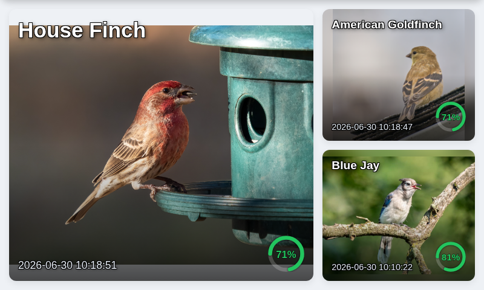
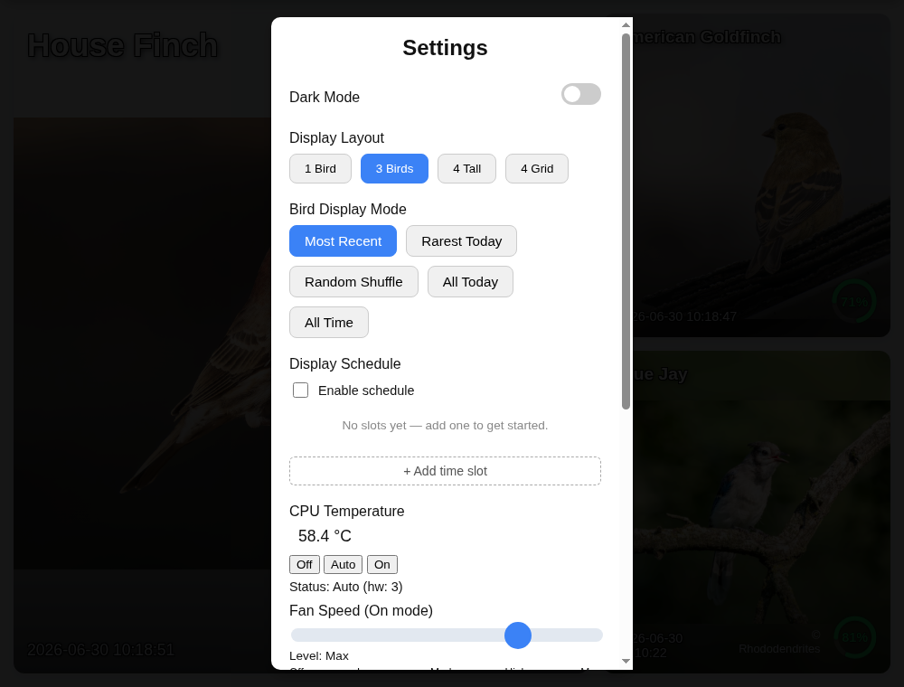
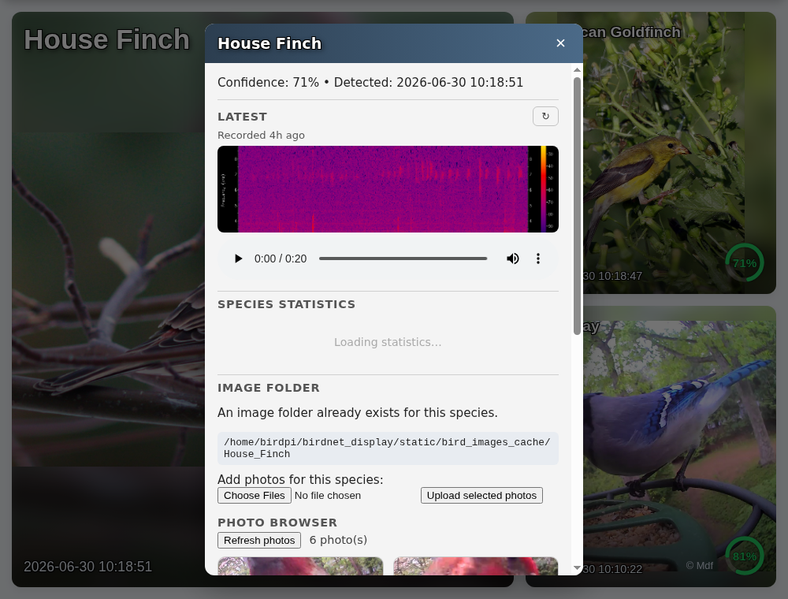
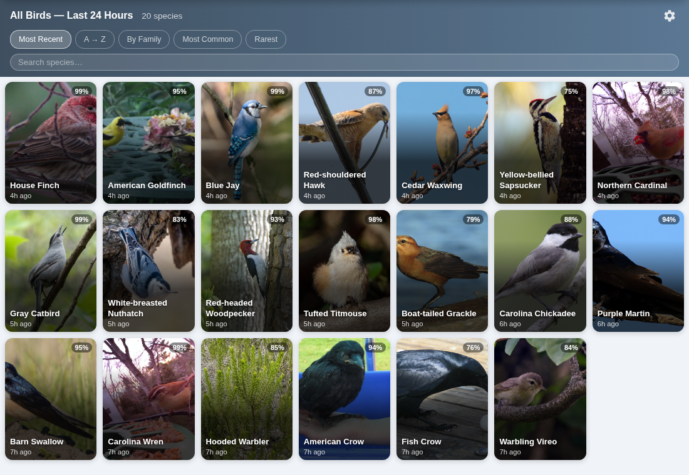
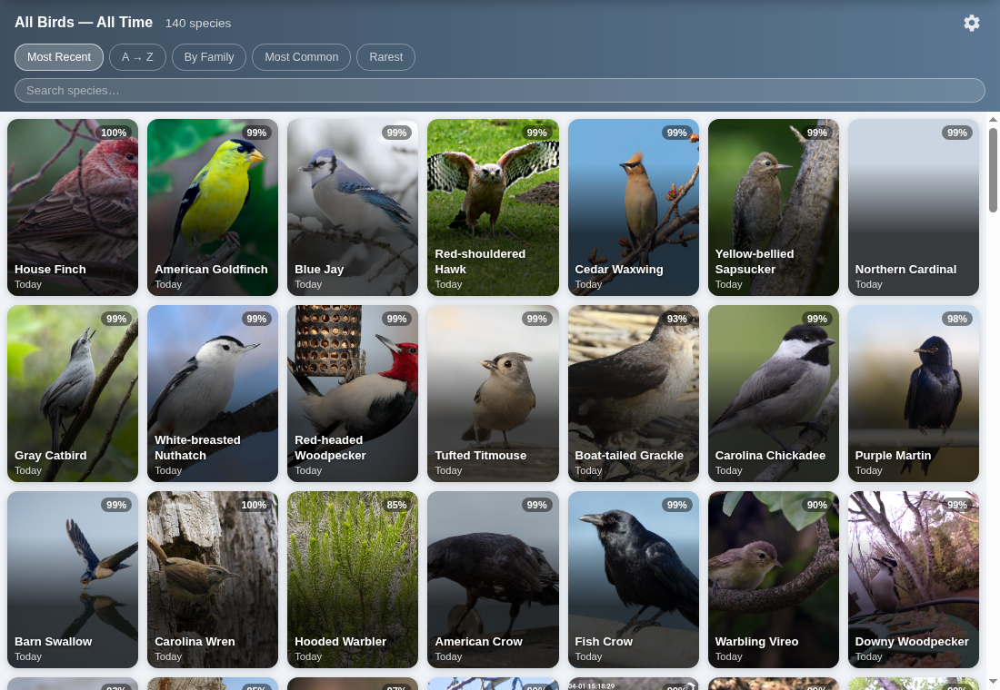
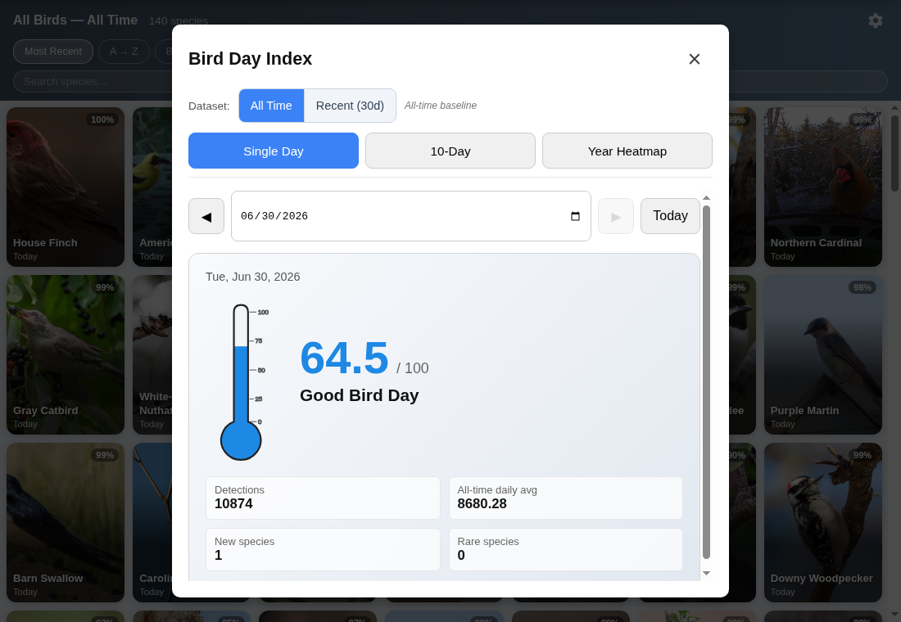
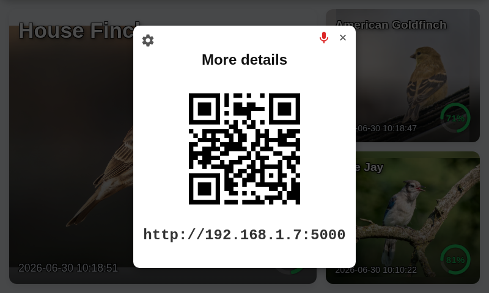

# BirdNET Display

A Raspberry Pi touchscreen display for a BirdNET-Pi/BirdNET-Go station. It shows recent bird detections, local bird photos, daily and all-time species views, QR access, system controls, and optional audio clip playback from recorded detections.

This repo tracks the full display project, including the Flask backend (`birdnet_display.py`), cache builder, installer scripts, 3D print files, images, and the web UI in `static/index.html`.

## Credits

This project began from the original BirdNET display work by C4KEW4LK:

https://github.com/C4KEW4LK/birdnet_display

That original project provided the foundation for a Raspberry Pi based BirdNET display with a Flask backend, cached bird images, and a browser-based interface. This repo is my continued build of that display, with changes made over roughly eight months of day-to-day use on my own BirdNET setup.

## What This Version Adds

- Expanded touchscreen interface in `static/index.html`, with multiple display layouts, dark mode, settings panels, all-birds views, all-time views, and search/sort controls.
- Better local image handling, including species folder detection, placeholder images, no-photo states, photo upload, photo browsing, and image deletion from the UI.
- Detection audio support, including latest clip, best clip, spectrogram serving, per-species playback, first-detection playback, and periodic "chirp" style playback from today's detections.
- Bird activity views backed by the local BirdNET database, including recent detections, all species detected today, all-time detections, species stats, and bird-day index endpoints.
- Raspberry Pi hardware controls from the display UI, including screen brightness, reboot, shutdown, fan mode, fan speed, CPU temperature, and hardware fan-state feedback.
- QR code overlay for quickly opening the display from another device on the network.
- Offline and waiting-for-detections behavior using cached species images or placeholder photos instead of showing a blank screen.
- Kiosk launcher, installer, access-point setup script, and included 3D-print files for a complete physical display build.

## Screenshots and Build Photos

### Current UI Highlights

Live recent detections on the touchscreen layout:



Settings panel with layout, display mode, schedule, temperature, fan, and system controls:



Per-species detail panel with latest recording, spectrogram, stats, image folder tools, uploads, and photo browser:



All birds detected in the last 24 hours, with sorting and search:



All-time species view:



Bird Day Index analytics:



QR access overlay:



### Completed System

Front:


Side:


Internals:


## Features

- Designed for a Raspberry Pi with an attached 800x480 class touchscreen.
- Integrates with a local BirdNET-Pi/BirdNET-Go installation and SQLite detection database.
- Shows recent detections with confidence, species photos, timing, and folder/photo status.
- Provides all-birds and all-time views for reviewing detected species.
- Serves the complete browser UI from `static/index.html`.
- Uses local image caches so the display remains useful offline.
- Lets you create species image folders and upload/manage photos from the web UI.
- Plays locally stored detection clips when available.
- Includes kiosk-mode startup support for a dedicated display.
- Provides brightness, fan, reboot, and poweroff controls from the UI.
- Includes AP setup support for field/local deployments.
- Includes 3D-print files for the display enclosure and microphone housing.

## Setup and Installation

### Automatic Installation

On a Raspberry Pi:

```bash
git clone https://github.com/Fjord-of-the-RIngs/birdnet_display.git
cd birdnet_display
chmod +x install.sh
./install.sh
```

The installer sets up the application directory, Python virtual environment, dependencies, image cache, and optional kiosk/networking pieces.

### Manual Installation

```bash
git clone https://github.com/Fjord-of-the-RIngs/birdnet_display.git
cd birdnet_display
python3 -m venv venv
source venv/bin/activate
pip install -r requirements.txt
python cache_builder.py
python birdnet_display.py
```

If `venv` support is missing:

```bash
sudo apt-get install python3-venv
```

## Usage

Run the application manually:

```bash
cd ~/birdnet_display
./run.sh
```

Then open:

```text
http://<your-pi-ip>:5000
```

If kiosk mode is enabled, Chromium launches the display automatically on boot.

## Configuration

The main paths and service settings are near the top of `birdnet_display.py`, including:

- `BASE_URL`: BirdNET web/API base URL.
- `SERVER_PORT`: Flask display server port.
- `BIRD_IMAGE_CACHE_BASE`: local bird photo cache.
- `EXTRACTED_DIR`: extracted BirdNET audio/spectrogram location.
- `PLACEHOLDER_DIRECTORY`: fallback image directory.

Edit `species_list.csv` to control which species are used for offline/cache building, then rebuild:

```bash
cd ~/birdnet_display
source venv/bin/activate
python cache_builder.py
```

## Project Structure

```text
.
├── 3d print files/          # 3D printable enclosure and microphone housing files
├── images/                  # README screenshots and build photos
├── static/
│   └── index.html           # Main touchscreen/browser UI
├── ap_setup.sh              # Wi-Fi access point setup helper
├── birdnet_display.py       # Main Flask backend
├── cache_builder.py         # Local bird image cache builder
├── install.sh               # Raspberry Pi installer
├── kiosk_launcher.sh        # Chromium kiosk launcher
├── requirements.txt         # Python dependencies
├── run.sh                   # App runner
└── species_list.csv         # Species list for cache building
```

## Access Point Setup

`ap_setup.sh` can configure the Raspberry Pi as a Wi-Fi access point for deployments without a normal network.

Before running it, review and edit the variables at the top of the script:

- `WIFI_INTERFACE`
- `HOTSPOT_SSID`
- `HOTSPOT_PASSWORD`
- `DEVICE_MAC`
- `DEVICE_FIXED_IP`

Run with:

```bash
sudo ./ap_setup.sh
```

## 3D Printed Files

This repo includes 3D-print files for the main Raspberry Pi/display housing and ESP32 microphone housing. The files include options for direct screws or heat-set threaded inserts.

Main build hardware used:

- Raspberry Pi 4B.
- 5 inch DSI touchscreen.
- Panel-mount USB-C connector.
- GeeekPi Armor Lite style Raspberry Pi 4 heatsink/fan.
- M2 and M2.5 screws plus optional heat-set inserts.

## Troubleshooting

- If the UI does not load, confirm `static/index.html` exists beside `birdnet_display.py`.
- If bird photos do not appear, rebuild the cache with `python cache_builder.py`.
- If the app does not start on boot, check the service status and journal logs.
- If audio clips do not play, confirm the extracted BirdNET audio files exist under the configured `EXTRACTED_DIR`.
- If fan or brightness controls fail, confirm the Raspberry Pi hardware paths and sudo permissions match this setup.

## Repository

https://github.com/Fjord-of-the-RIngs/birdnet_display

## License

MIT License. Original project credit belongs to C4KEW4LK; this repo contains my ongoing modifications and additions.
